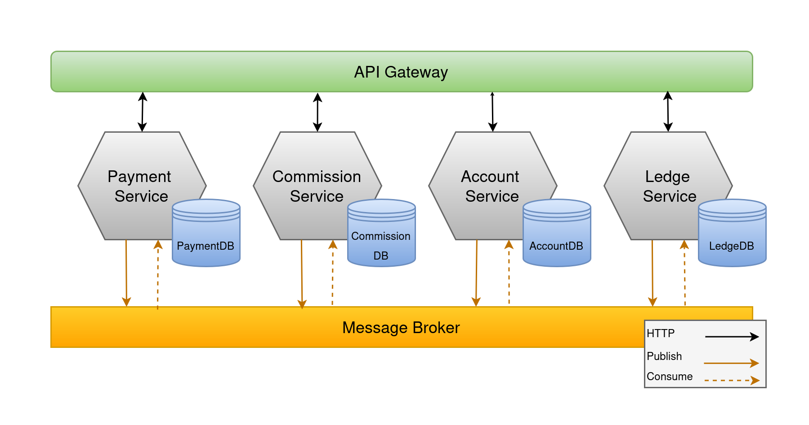
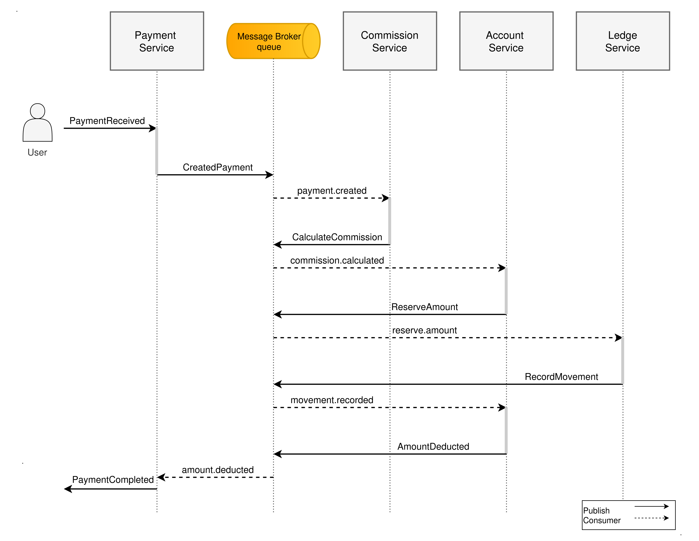
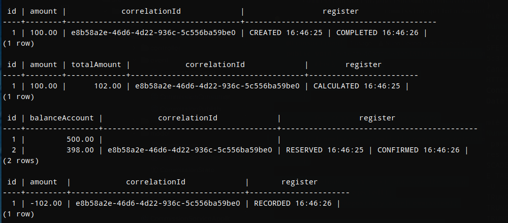
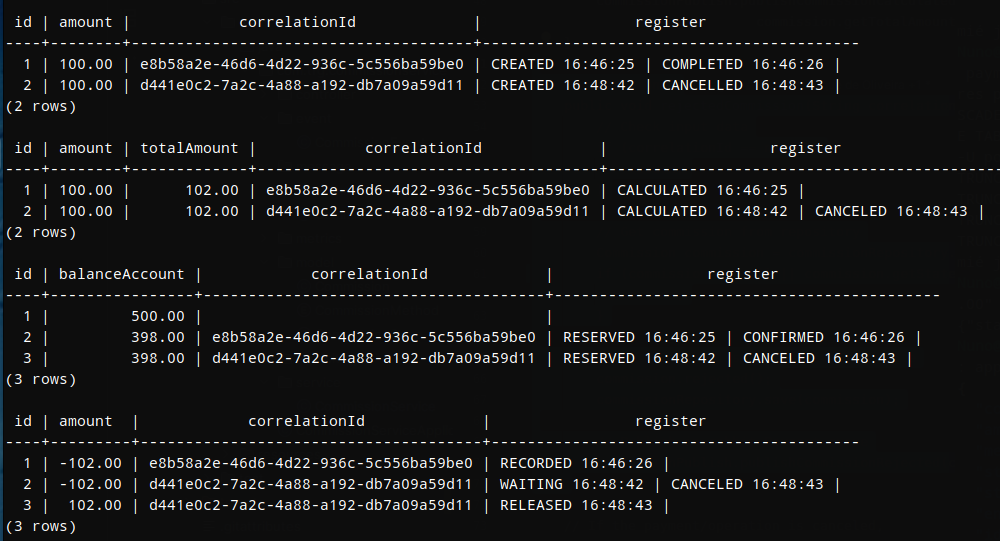
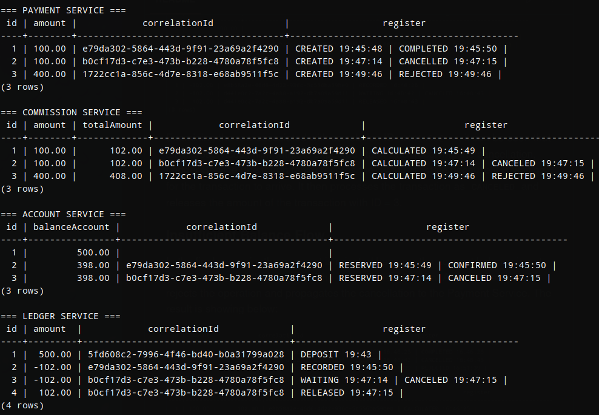
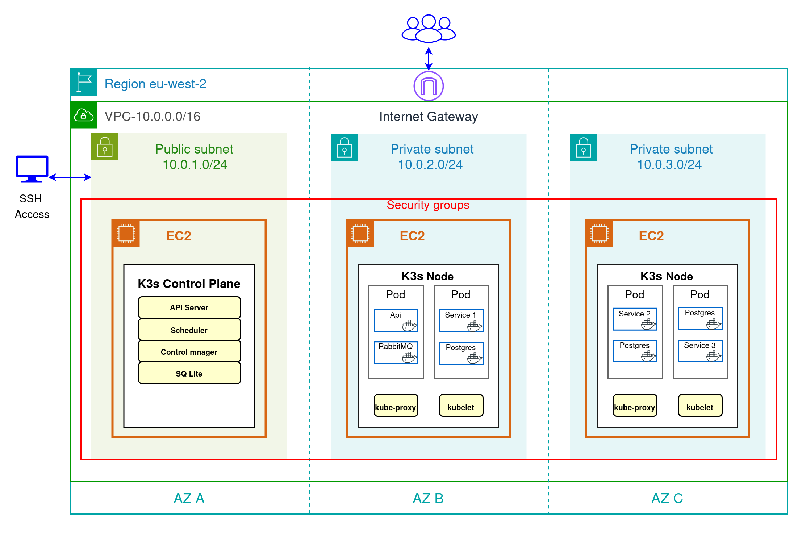
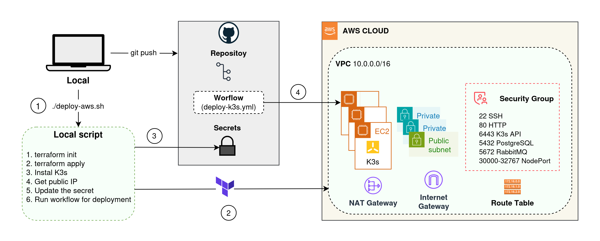
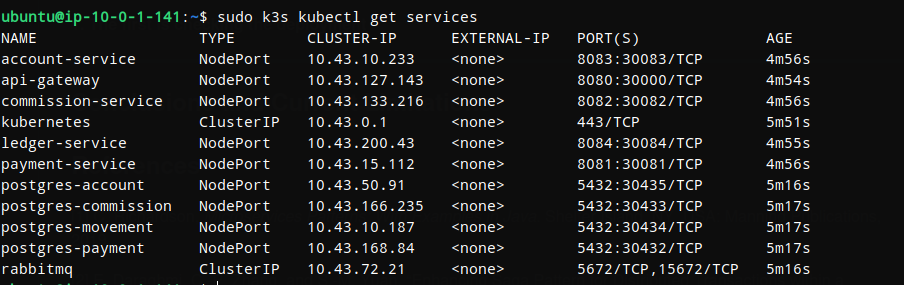
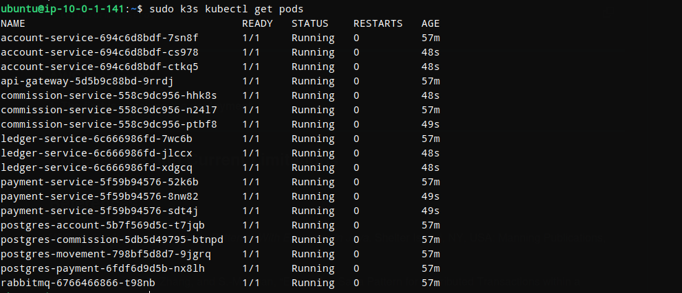

# Distributed Payment Platform

### Tech Stack


-yellow)


## Table of Contents

1. [Overview](#overview)
2. [Application Architecture](#application-architecture)
3. [Application Behavior](#application-behavior)
   - [Events and Transactions](#events-and-transactions)
   - [Payment successfull](#payment-successfull)
   - [Cancellation Flow](#cancellation-flow)
   - [Rejection Flow](#rejection-flow)
4. [Getting Started](#getting-started)
    - [Run locally](#run-locally)
5. [Local Evidence](#local-evidence)
   - [Successful Payment Flow](#successful-payment-flow)
   - [Cancellation and Compensation Flow](#cancellation-and-compensation-flow)
   - [Insufficient Balance Flow](#insufficient-balance-flow)
6. [Infrastructure Design](#infrastructure-design)
   - [AWS Network and Compute](#aws-network-and-compute)
   - [Kubernetes K3s](#kubernetes-k3s)
7. [Deployment of application](#deployment-of-application)
8. [Testing and Validation in AWS](#testing-and-alidation-in-AWS)
   - [Run in AWS](#run-in-aws)
   - [AWS Evidence](#aws-evidence)
9. [Conclusions and Current Limitations](#current-limitations)
10. [](#)
12. [References](#references)


## Overview

This project presents the design, deployment and evaluation of a distributed payment platform in a cloud environment.

At the application level, it implements a distributed payment platform based on the Saga choreography pattern. Each microservice completes a local transaction and publishes an asynchronous event that is consumed by another service. When an operation fails or is cancelled, each service executes a compensating transaction to reverse the previous steps and return the system to an eventually consistent state.

At the infrastructure level, Terraform creates the AWS environment required to run the platform. The architecture includes a VPC, one public subnet, two private subnets across three Availability Zones, security groups and three EC2 instances that form a Kubernetes K3s cluster.

Each application component is packaged as a Docker image and deployed on Kubernetes. GitHub Actions automates the build, image publication and deployment process independently for each service.

---

## Application Architecture

The application consists of an API Gateway and four independent microservices. The services communicate asynchronously through RabbitMQ, and each microservice owns its own PostgreSQL database.




- **API Gateway**: entry point for all HTTP requests. Routes operations to the appropriate service.

- **Payment Service**: manages the type of payments and creates the payment and starts the Saga flow.

- **Commission Service**: calculates the commission according to the payment method and sends the total amount to the next service.

- **Account Service**: manages the account balance. It reserves the funds when a payment starts and restores them if the payment is cancelled.

- **Ledger Service**: stores a permanent record of all money movements and works as the accounting ledger of the system.
  
---
 
 
## Application Behavior

### Events and Transactions

The Saga is implemented as a sequence of local transactions and asynchronous events. Each service publishes the result of its transaction, while compensating transactions are used when the operation fails or is cancelled.


#### All the events published and consumed

| Service | Events published | Events consumed |
|---|---|---|
| Payment Service | `payment.created`<br>`operation.canceled`<br>`operation.rejected` | `amount.deducted`<br>`operation.canceled`<br>`operation.rejected` |
| Commission Service | `commission.calculated`<br>`operation.rejected`<br>`operation.canceled` | `payment.created`<br>`amount.rejected`<br>`operation.canceled` |
| Account Service | `amount.reserved`<br>`amount.deducted`<br>`amount.rejected` | `commission.calculated`<br>`movement.recorded`<br>`movement.rejected`<br>`operation.canceled` |
| Ledger Service | `movement.recorded`<br>`movement.rejected`<br>`operation.canceled` | `amount.reserved`<br>`amount.deducted`<br>`operation.canceled` |


#### Transactions and Compensations

| Service | Local transaction | Compensation |
|---|---|---|
| Payment Service | `createPayment()` | `cancelPayment()` |
| Commission Service | `calculateCommission()` | `cancelCommission()` |
| Account Service | `reserveAmount()` | `cancelReservationAmount()` |
| Ledger Service | `recordMovement()` | `cancelMovement()` |


### Payment successfull

In the successful flow, every service completes its local transaction without errors. Each published event starts the next step until the payment is completed and the account and ledger are updated.




### Cancellation Flow

If one of the services rejects the operation or reports an error, the cancellation flow starts. The participating services execute compensating transactions to release reserved resources and restore a consistent state.

| Publisher | Event | Consumer |
|---|---|---|
| Payment Service | `operation.canceled` | Ledger Service |
| Ledger Service | `operation.canceled` | Account Service |
| Account Service | `operation.canceled` | Commission Service |
| Commission Service | `operation.canceled` | Payment Service |


### Rejection flow

| Publisher | Event | Consumer |
|---|---|---|
| Account Service | `amount.rejected` | Commission Service |
| Commission Service | `operation.rejected` | Payment Service |
---
  
  
## Getting Started

### Run locally

**Prerequisites**
- Docker and Docker Compose installed

**1. Clone and start all services**

```bash
git clone https://github.com/NunoDeOliveira/distributed-payment-platform
cd distributed-payment-platform
docker-compose up
```

Wait a few seconds for all services to initialize.

**2. Add an initial balance to the account**

```bash
curl -X POST "http://localhost:8080/balances/add?balanceAccount=500.00"
```

**3. Create a payment**

```bash
curl -X POST "http://localhost:8080/payments" -H "Content-Type: application/json" -d \ '{"amount": 100.00, "method": "INTERNATIONAL_TRANSFER"}'
```

The response includes the payment `id`. Use it to list or cancel the payment:

**4. List all payments**

```bash
curl "http://localhost:8080/payments"
```

**5. Cancel a payment**

```bash
curl -X DELETE "http://localhost:8080/payments/{id}"
```
---


### Querys for Databases

The following queries verify the state of each service database after running both a successful payment and a cancellation. Each service records its local transaction  independently, demonstrating the Saga choreography pattern flow.

For local testing, a script is provided to automate the creation and cancellation of a payment. For running the test: 

```bash
cd distributed-payment-platform
./test-cancel-payment.sh
```


**Payment Service**: shows the payment lifecycle:

```bash
docker exec -e PGPASSWORD=postgres postgres-tfg psql -U postgres -d paymentdb -c "SELECT id, amount, correlation_id AS \"correlationId\", register FROM payments ORDER BY id ASC;"
```


**Commission Service**: shows the commission calculated:

```bash
docker exec -e PGPASSWORD=postgres postgres-tfg psql -U postgres -d commissiondb -c "SELECT id, amount, total_amount AS \"totalAmount\", correlation_id AS \"correlationId\", register FROM commissions ORDER BY id ASC;"
```


**Account Service**: shows the account balance:

```bash
docker exec -e PGPASSWORD=postgres postgres-tfg psql -U postgres -d accountdb -c "SELECT id, balance_account AS \"balanceAccount\", correlation_id AS \"correlationId\", register FROM balances ORDER BY id ASC;"
```


**Ledger Service**: shows the immutable the record movements:

```bash
docker exec -e PGPASSWORD=postgres postgres-tfg psql -U postgres -d movementdb -c "SELECT id, amount, correlation_id AS \"correlationId\", register FROM movements ORDER BY id DESC LIMIT 20;"
```


Now using the `watch` command combined with operator `&&`, all four database queries can be unified into a single command, allowing the real-time observation of the state of each service stored in database. The command is shown below:

```bash
watch -n 2 '
echo "=== PAYMENT SERVICE ===" &&
docker exec -e PGPASSWORD=postgres postgres-tfg psql -U postgres -d paymentdb -c "SELECT id, amount, correlation_id AS \"correlationId\", register FROM payments ORDER BY id ASC;" &&
echo "=== COMMISSION SERVICE ===" &&
docker exec -e PGPASSWORD=postgres postgres-tfg psql -U postgres -d commissiondb -c "SELECT id, amount, total_amount AS \"totalAmount\", correlation_id AS \"correlationId\", register FROM commissions ORDER BY id ASC;" &&
echo "=== ACCOUNT SERVICE ===" &&
docker exec -e PGPASSWORD=postgres postgres-tfg psql -U postgres -d accountdb -c "SELECT id, balance_account AS \"balanceAccount\", correlation_id AS \"correlationId\", register FROM balances ORDER BY id ASC;" &&
echo "=== LEDGER SERVICE ===" &&
docker exec -e PGPASSWORD=postgres postgres-tfg psql -U postgres -d movementdb -c "SELECT id, amount, correlation_id AS \"correlationId\", register FROM movements ORDER BY id ASC;"
'
```

> **Note:**: The refresh interval can be adjusted by changing the value of the `-n` parameter. The default time is 2 seconds.


## Local evidency

The test results are shown below. For all tests, the database screenshots follow the same numerical order:

1. Payment Service
2. Commission Service
3. Account Service 
4. Ledger Service

### Successful Payment Flow

In the first test, a payment is processed through the successful flow. The expected states are:

| Microservice | Expected state |
|---|---|
| Payment Service | `COMPLETED` |
| Commission Service | `CALCULATED` |
| Account Service | `CONFIRMED` |
| Ledger Service | `RECORDED` |

The result is:



1. A payment request for 100.00 monetary units is received. Payment Service creates the payment with correlation ID e8b58a2e….

2. Commission Service calculates the commission according to the payment type. The resulting total amount is 102.00 monetary units.

3. The initial account balance is 500.00. After processing the payment and its commission, the resulting balance is 398.00.

4. Finally, Ledger Service records the movement for the 102.00 monetary units deducted from the account.

Therefore, the successful payment flow finishes correctly.


### Cancellation and Compensation Flow

In the next scenario, the payment is canceled before the flow is completed. The expected result is: 

| Microservice | Expected state |
|---|---|
| Payment Service | `CANCELED` |
| Commission Service | `CANCELED` |
| Account Service | `CANCELED` |
| Ledger Service | `CANCELED` |

The result is:
 


Examining the row associated with correlation ID `d441e0c2 …`, it can be seen that all microservices finish with the expected state. After receiving the cancellation, Ledger Service (the fourth table) records the `WAITING` state because it is waiting for the transaction to arrive. It then processes the transaction as `CANCELED` and releases the amount of the transaction with ID = 3.


### Insufficient Balance Flow

In the final scenario, the payment is rejected because the account balance is not sufficient to make the payment. The expected result is that Account Service rejects the operation and propagates the cancellation to the Payment Service. The result is showing below:




---


## Infrastructure Design

The infrastructure runs in the AWS `eu-west-2` region and is created with Terraform. It includes a network, three EC2 instances, and a K3s cluster distributed across three Availability Zones.




### AWS Network and Compute

- **VPC**: all infrastructure resources are placed inside a `10.0.0.0/16` Virtual Private Cloud.

- **Subnets**: the VPC has one public subnet for the K3s server and two private subnets for the worker nodes. Each subnet is located in a different Availability Zone.

- **Internet connectivity**: the Internet Gateway connects the public subnet to the Internet. The NAT Gateway allows the private worker nodes to access the Internet without accepting direct connections from outside the VPC.

- **EC2 instances**: one EC2 instance runs the K3s control plane, and two EC2 instances work as worker nodes.

- **Security groups**: security groups control access to SSH, the K3s API, the application `NodePort`, PostgreSQL, and communication between the cluster nodes.

### Kubernetes (K3s)

- **Control plane**: the K3s server runs the Kubernetes API Server, Scheduler, Controller Manager, and SQLite datastore.

- **Worker nodes**: the two K3s agents run the application Pods selected by the Kubernetes Scheduler.

- **Application workloads**: the API Gateway, microservices, RabbitMQ, and PostgreSQL databases run as Kubernetes workloads inside the cluster.

- **Application access**: external test requests reach the API Gateway through a Kubernetes `NodePort` service on port `30000`. Internal Kubernetes Services allow the application components to communicate with each other.

---  


## Deployment of application

### Docker

For deployment, each microservice is packaged as a Docker image. GitHub Actions automates the build and publication of the images and applies the Kubernetes manifests to the K3s cluster.

### CI/CD with GitHub Actions

GitHub Actions builds and publishes the Docker images and deploys the Kubernetes resources required by the application.



---


## Testing and Validation in AWS

### Run in AWS

**Prerequisites**

- AWS account and configured credentials;
- SSH private key for the control-plane instance
- an existing AWS EC2 key pair
- Terraform;


**1. Provision the infrastructure**

```bash
./scripts/deploy-aws.sh
```

Terraform provisions the EC2 instances, installs K3s and deploys the microservices automatically. The output includes the Control Plane IP address.

**2. Access the cluster**

```bash
ssh -i YOUR_KEY.pem ubuntu@<CONTROL_PLANE_IP>
```

**3. Verify the deployment**

```bash
sudo k3s kubectl get nodes
sudo k3s kubectl get deployments
sudo k3s kubectl get pods
sudo k3s kubectl get services
```

**4. Destroy the AWS infrastructure**

```bash
terraform destroy
```

---


### AWS Evidence

**1. The first is checking the deployment**



**2. Scale to 3 replicas per microservice. Execute this command in control plane**

```bash
sudo k3s kubectl scale deployment payment-service --replicas=3 &&
sudo k3s kubectl scale deployment commission-service --replicas=3 &&
sudo k3s kubectl scale deployment account-service --replicas=3 &&
sudo k3s kubectl scale deployment ledger-service --replicas=3
```

**3. The capture**




**4. Capture**


---


## Conclusions and Current Limitations


## References

[1] C. Richardson, *Microservices Patterns: With Examples in Java*.
Shelter Island, NY, USA: Manning Publications, 2019.

[2] E. Daraghmi, C.-P. Zhang, and S.-M. Yuan, “Enhancing Saga Pattern
for Distributed Transactions within a Microservices Architecture,”
*Applied Sciences*, vol. 12, no. 12, Art. no. 6242, Jun. 2022,
doi: 10.3390/app12126242.

[3] GitHub, “Workflow syntax for GitHub Actions,” *GitHub Docs*.
[Online]. Available:
https://docs.github.com/actions/using-workflows/workflow-syntax-for-github-actions

[4] GitHub, “Publishing Docker images,” *GitHub Docs*. [Online].
Available:
https://docs.github.com/actions/guides/publishing-docker-images

[5] Apache Maven Project, “Maven Surefire Plugin.” [Online].
Available:
https://maven.apache.org/surefire/maven-surefire-plugin/.

[6] Kubernetes Authors, “Deployments,” *Kubernetes Documentation*.
[Online]. Available:
https://kubernetes.io/docs/concepts/workloads/controllers/deployment/

[7] Kubernetes Authors, “kubectl port-forward,”
*Kubernetes Documentation*. [Online]. Available:
https://kubernetes.io/docs/reference/kubectl/generated/kubectl_port-forward/

[8] Spring, “Actuator endpoints,” *Spring Boot Reference Documentation*.
[Online]. Available:
https://docs.spring.io/spring-boot/reference/actuator/endpoints.html

[9] K3s Project, “Architecture,” *K3s Documentation*. [Online].
Available:
https://docs.k3s.io/architecture.

[10] HashiCorp, “What is Terraform?,” *Terraform Documentation*.
[Online]. Available:
https://developer.hashicorp.com/terraform/intro.

[11] Amazon Web Services, “What is Amazon VPC?,”
*Amazon VPC User Guide*. [Online]. Available:
https://docs.aws.amazon.com/vpc/latest/userguide/what-is-amazon-vpc.html

[12] Amazon Web Services, “What is Amazon EC2?,”
*Amazon EC2 User Guide*. [Online]. Available:
https://docs.aws.amazon.com/AWSEC2/latest/UserGuide/concepts.html

[13] Working with objects, “Objects In Kubernetes,”
*Kubernetes Documentation*. [Online]. Available:
https://kubernetes.io/docs/concepts/overview/working-with-objects/

[14] FreeCodeCamp "Bash Scripting Tutorial – Linux Shell Script and Command Line for Beginners,”
*Bash*. [Online]. Available:
https://www.freecodecamp.org/news/bash-scripting-tutorial-linux-shell-script-and-command-line-for-beginners/
