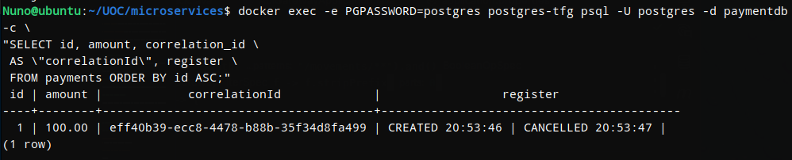
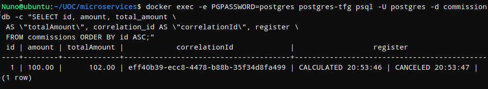
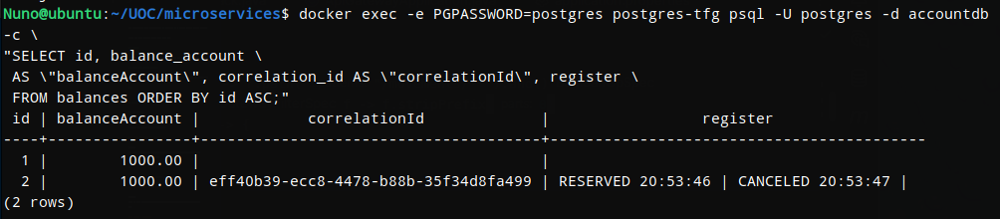
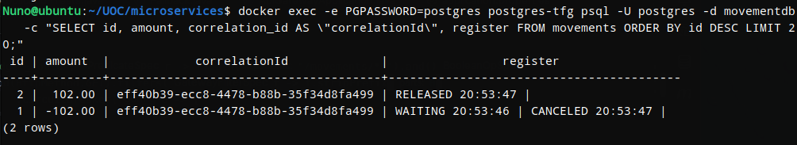

# Distributed Payment Platform

### Tech Stack


-yellow)


## Table of Contents

1. [Overview](#overview)
2. [Application Architecture](#application-architecture)
3. [Application Behavior](#application-behavior)
   - [Events and Transactions](#events-and-transactions)
   - [Happy Path Flow](#happy-path-flow)
   - [Cancellation Flow](#cancellation-flow)
4. [Infrastructure Design](#infrastructure-design)
   - [AWS Network and Compute](#aws-network-and-compute)
   - [Kubernetes K3s](#kubernetes-k3s)
5. [Tech Stack](#tech-stack)
6. [Getting Started](#getting-started)
   - [Run locally](#run-locally)
   - [Run in AWS](#run-in-aws)
7. [Testing and Validation](#testing-and-validation)
   - [Local Evidence](#local-evidence)
   - [AWS Evidence](#aws-evidence)
8. [Observability and Monitoring](#observability-and-monitoring)
9. [Current Limitations](#current-limitations)
10. [License](#license)


## Overview

Traditional banking systems can have difficulties when they need to coordinate operations between independent services without using one central database. This project shows how distributed transactions can be managed with the Saga choreography pattern. Each service completes its own local transaction and publishes an event that starts the next step, without using a central coordinator.

---

## 

The project studies how a distributed payment operation can be coordinated across independent services without using a shared database or a global transaction. The system implements Saga choreography and evaluates its functional behavior, temporary inconsistencies, concurrent execution, and performance.


## Application Architecture

The application consists of an API Gateway and four independent microservices. The services communicate asynchronously through RabbitMQ, and each microservice owns its own PostgreSQL database.


##### *Logical architecture of the application and communication between the Saga participants.*

- **API Gateway**: entry point for all HTTP requests. Routes operations to the appropriate service.
- **Payment Service**: manages the type of payments and creates the payment and starts the Saga flow.
- **Commission Service**: calculates the commission according to the payment method and sends the total amount to the next service.
- **Account Service**: manages the account balance. It reserves the funds when a payment starts and restores them if the payment is cancelled.
- **Ledger Service**: stores a permanent record of all money movements and works as the accounting ledger of the system.
  
---
 
 
## Application Behavior

### Events and Transactions

The Saga is implemented as a sequence of local transactions and asynchronous events. Each service publishes the result of its transaction, while compensating transactions are used when the operation fails or is cancelled.


#### Events published and consumed

| Service | Events published | Events consumed |
|---|---|---|
| Payment Service | `payment.created`<br>`operation.canceled` | `amount.deducted`<br>`operation.canceled` |
| Commission Service | `commission.calculated`<br>`commission.released`<br>`operation.canceled` | `payment.created`<br>`operation.rejected`<br>`operation.canceled` |
| Account Service | `amount.reserved`<br>`amount.deducted`<br>`amount.rejected` | `commission.calculated`<br>`movement.recorded`<br>`movement.rejected`<br>`operation.canceled` |
| Ledger Service | `movement.recorded`<br>`movement.rejected`<br>`operation.canceled` | `amount.reserved`<br>`amount.deducted`<br>`operation.canceled` |


#### Transactions and Compensations

| Service | Local transaction | Compensation |
|---|---|---|
| Payment Service | `createPayment()` | `cancelPayment()` |
| Commission Service | `calculateCommission()` | `cancelCommission()` |
| Account Service | `reserveAmount()` | `cancelReservationAmount()` |
| Ledger Service | `recordMovement()` | `cancelMovement()` |


### Happy Path Flow

In the successful flow, every service completes its local transaction without errors. Each published event starts the next step until the payment is completed and the account and ledger are updated.


####      *Successful Saga flow, from payment creation to movement recorded.*


### Cancellation Flow

If one of the services rejects the operation or reports an error, the cancellation flow starts. The participating services execute compensating transactions to release reserved resources and restore a consistent state.


####               *Cancellation flow and compensating transactions*


## Technology Stack

| Area | Technologies |
|---|---|
| Backend | Spring Boot, Spring Cloud Gateway |
| Persistence | PostgreSQL, Spring Data JPA |
| Communication | RabbitMQ, HTTP |
| Infrastructure | AWS EC2, Kubernetes (K3s), Docker |
| For Deployment | Terraform (IaC), GitHub Actions (CI/CD) |

---


## Design of Infraestructure

The infrastructure runs in the AWS `eu-west-2` region and is created with Terraform. It includes a network, three EC2 instances, and a K3s cluster distributed across three Availability Zones.


*AWS infrastructure and Kubernetes K3s cluster where Application is deployment.*


### AWS Network and Compute

- **VPC**: all infrastructure resources are placed inside a `10.0.0.0/16` Virtual Private Cloud.

- **Subnets**: the VPC has one public subnet for the K3s server and two private subnets for the worker nodes. Each subnet is located in a different Availability Zone.

- **Internet connectivity**: the Internet Gateway connects the public subnet to the Internet. The NAT Gateway allows the private worker nodes to access the Internet without accepting direct connections from outside the VPC.

- **EC2 instances**: one EC2 instance runs the K3s control plane, and two EC2 instances work as worker nodes.

- **Security groups**: security groups control access to SSH, the K3s API, the application `NodePort`, PostgreSQL, and communication between the cluster nodes.

### Kubernetes (K3s)

- **Control plane**: the K3s server runs the Kubernetes API Server, Scheduler, Controller Manager, and SQLite datastore.

- **Worker nodes**: the two K3s agents run the application Pods selected by the Kubernetes Scheduler.

- **Application workloads**: the API Gateway, microservices, RabbitMQ, and PostgreSQL databases run as Kubernetes workloads inside the cluster.

- **Application access**: external test requests reach the API Gateway through a Kubernetes `NodePort` service on port `30000`. Internal Kubernetes Services allow the application components to communicate with each other.
  


## Deployment of application

For deployment, each microservice is packaged as a Docker image. GitHub Actions automates the build and publication of the images and applies the Kubernetes manifests to the K3s cluster.

CI/CD For more detail, check this link --> 

### Docker

Each service has its own Docker image containing the application and its runtime dependencies.

### CI/CD with GitHub Actions

GitHub Actions builds and publishes the Docker images and deploys the Kubernetes resources required by the application.

---
  
  
## Getting Started

### Run locally

**Prerequisites**
- Docker and Docker Compose installed

**1. Clone and start all services**

```bash
git clone https://github.com/NunoDeOliveira/distributed-payment-platform
cd distributed-payment-platform
docker-compose up
```

Wait a few seconds for all services to initialize.

**2. Add an initial balance to the account**

```bash
curl -X POST "http://localhost:8083/balances/add?balanceAccount=1000.00"
```

**3. Create a payment**

```bash
curl -X POST "http://localhost:8080/payments" \
  -H "Content-Type: application/json" \
  -d '{"amount": 100.00, "method": "INTERNATIONAL_TRANSFER"}'
```

The response includes the payment `id`. Use it to list or cancel the payment:

**4. List all payments**

```bash
curl http://localhost:8080/payments
```

**5. Cancel a payment**

```bash
curl -X DELETE "http://localhost:8080/payments/{id}"
```


### Run in AWS

**Prerequisites**
- AWS account with credentials configured
- Terraform installed

**1. Provision the infrastructure**

```bash
cd infrastructure/terraform
terraform init
terraform apply
```

Terraform provisions the EC2 instances, installs K3s and deploys the microservices 
automatically. The output includes the Control Plane IP address.

**2. Access the cluster**

```bash
ssh -i YOUR_KEY.pem ubuntu@<CONTROL_PLANE_IP>
```

**3. Verify the deployment**

```bash
kubectl get pods
kubectl get services
```

---


## Testing and Validation

### Local Evidence

The following queries verify the state of each service database after running both a successful payment and a cancellation. Each service records its local transaction  independently, demonstrating the Saga choreography pattern flow.


**Payment Service**- shows the payment lifecycle:
```bash
docker exec -e PGPASSWORD=postgres postgres-tfg psql -U postgres -d paymentdb -c \
"SELECT id, amount, correlation_id \
 AS \"correlationId\", register \
 FROM payments ORDER BY id ASC;"
```
Result:



**Commission Service** - shows the commission calculated:
```bash
docker exec -e PGPASSWORD=postgres postgres-tfg psql -U postgres -d commissiondb -c \
"SELECT id, amount, total_amount \
 AS \"totalAmount\", correlation_id AS \"correlationId\", register \
 FROM commissions ORDER BY id ASC;"
```
Result:



**Account Service** - shows the account balance:
```bash
docker exec -e PGPASSWORD=postgres postgres-tfg psql -U postgres -d accountdb -c \
"SELECT id, balance_account \
 AS \"balanceAccount\", correlation_id AS \"correlationId\", register \
 FROM balances ORDER BY id ASC;"
```
Result:



**Ledger Service** - shows the immutable the record movements:
```bash
docker exec -e PGPASSWORD=postgres postgres-tfg psql -U postgres -d movementdb -c \
"SELECT id, amount, correlation_id \
 AS \"correlationId\", register \
 FROM deliveries ORDER BY id ASC;"
```
Result:




### AWS Evidence


---

## Design Decisions


## References

[1] C. Richardson, *Microservices Patterns: With Examples in Java*.
Shelter Island, NY, USA: Manning Publications, 2019.

[2] E. Daraghmi, C.-P. Zhang, and S.-M. Yuan, “Enhancing Saga Pattern
for Distributed Transactions within a Microservices Architecture,”
*Applied Sciences*, vol. 12, no. 12, Art. no. 6242, Jun. 2022,
doi: 10.3390/app12126242.

[3] GitHub, “Workflow syntax for GitHub Actions,” *GitHub Docs*.
[Online]. Available:
https://docs.github.com/actions/using-workflows/workflow-syntax-for-github-actions.
[Accessed: Jul. 13, 2026].

[4] GitHub, “Publishing Docker images,” *GitHub Docs*. [Online].
Available:
https://docs.github.com/actions/guides/publishing-docker-images.
[Accessed: Jul. 13, 2026].

[5] Apache Maven Project, “Maven Surefire Plugin.” [Online].
Available:
https://maven.apache.org/surefire/maven-surefire-plugin/.
[Accessed: Jul. 13, 2026].

[6] Kubernetes Authors, “Deployments,” *Kubernetes Documentation*.
[Online]. Available:
https://kubernetes.io/docs/concepts/workloads/controllers/deployment/.
[Accessed: Jul. 13, 2026].

[7] Kubernetes Authors, “kubectl port-forward,”
*Kubernetes Documentation*. [Online]. Available:
https://kubernetes.io/docs/reference/kubectl/generated/kubectl_port-forward/.
[Accessed: Jul. 13, 2026].

[8] Spring, “Actuator endpoints,” *Spring Boot Reference Documentation*.
[Online]. Available:
https://docs.spring.io/spring-boot/reference/actuator/endpoints.html.
[Accessed: Jul. 13, 2026].

[9] K3s Project, “Architecture,” *K3s Documentation*. [Online].
Available:
https://docs.k3s.io/architecture.
[Accessed: Jul. 13, 2026].

[10] HashiCorp, “What is Terraform?,” *Terraform Documentation*.
[Online]. Available:
https://developer.hashicorp.com/terraform/intro.
[Accessed: Jul. 13, 2026].

[11] Amazon Web Services, “What is Amazon VPC?,”
*Amazon VPC User Guide*. [Online]. Available:
https://docs.aws.amazon.com/vpc/latest/userguide/what-is-amazon-vpc.html.
[Accessed: Jul. 13, 2026].

[12] Amazon Web Services, “What is Amazon EC2?,”
*Amazon EC2 User Guide*. [Online]. Available:
https://docs.aws.amazon.com/AWSEC2/latest/UserGuide/concepts.html.
[Accessed: Jul. 13, 2026].
