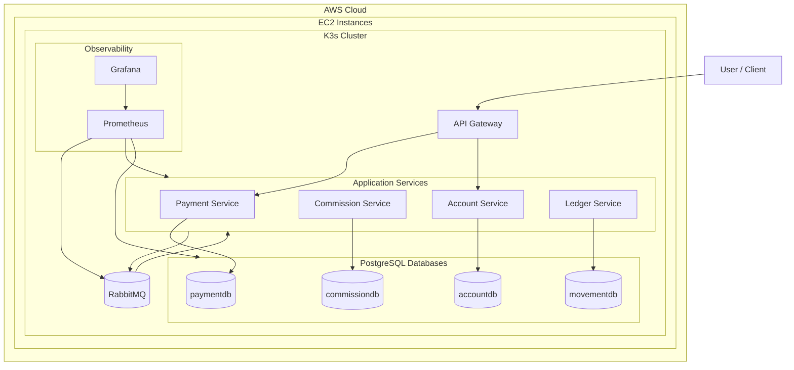

# Digital Banking Platform: Saga Choreography

## Overview
This microservice is a prototype designed to efficiently and scalably manage the inventory of a distributed warehouse. Its main objective is to demonstrate the viability of the Saga pattern (Choreography) for maintaining eventual consistency in distributed transactions without requiring a central orchestrator.

The system is based on independent services built with Spring Boot that communicate asynchronously via a message broker (RabbitMQ), ensuring temporal and spatial decoupling.


**Digital Banking Platform** is a distributed microservices prototype that simulates the processing of a banking payment using the **Saga pattern with choreography**.

The main objective of the project is to demonstrate how a distributed transaction can be coordinated without a central orchestrator. Each microservice executes its own local transaction, persists its state independently, and communicates with the rest of the system through asynchronous events.

The system uses **Spring Boot**, **RabbitMQ** and **PostgreSQL** to implement an event-driven architecture with eventual consistency.

---

## Contexto del proyecto

La aplicación representa una operación bancaria distribuida compuesta por varios pasos independientes:

1. creación del pago,
2. cálculo de comisión,
3. reserva del saldo,
4. registro contable del movimiento,
5. confirmación final del pago.

Cada paso pertenece a un microservicio distinto. La consistencia global no se obtiene mediante una transacción distribuida, sino mediante la publicación y consumo de eventos entre servicios.

---

## System Components

| Component | Technology | Role | Port / Note |
|---|---|---|---|
| API Gateway | Spring Cloud Gateway | Entry point / request routing | 8080 |
| Payment Service | Spring Boot | Payment creation and final state management | 8081 |
| Commission Service | Spring Boot | Commission calculation and compensation | 8082 |
| Account Service | Spring Boot | Balance reservation, confirmation and release | 8083 |
| Ledger Service | Spring Boot | Ledger movement registration | 8084 |
| Messaging Broker | RabbitMQ | Asynchronous event communication | 5672 / 15672 |
| Database | PostgreSQL | Persistent storage per service | 5432 |

---

## System Architecture: Application and Infrastructure

## System Architecture: Application and Infrastructure

The platform is designed as a distributed system composed of independent Spring Boot microservices. Each service owns its local data model and communicates with the rest of the system through asynchronous events published in RabbitMQ.

The local version runs with Docker containers for RabbitMQ and PostgreSQL. The target deployment architecture is prepared for **AWS EC2 instances running a K3s cluster**, where each microservice can be deployed as a Kubernetes workload.

---

## System Components

| Layer | Component | Technology | Role |
|---|---|---|---|
| Cloud Infrastructure | AWS EC2 | Virtual machines | Hosts the K3s cluster nodes |
| Container Orchestration | K3s | Lightweight Kubernetes | Runs and manages the microservice workloads |
| Entry Point | API Gateway | Spring Cloud Gateway | Routes external HTTP requests to internal services |
| Business Service | Payment Service | Spring Boot | Creates and completes payments |
| Business Service | Commission Service | Spring Boot | Calculates and compensates commissions |
| Business Service | Account Service | Spring Boot | Reserves, confirms and releases account balance |
| Business Service | Ledger Service | Spring Boot | Records ledger movements |
| Messaging | RabbitMQ | Message broker | Enables asynchronous event-driven communication |
| Persistence | PostgreSQL | Relational database | Stores the local state of each service |
| Observability | Prometheus / Grafana | Monitoring stack | Collects and visualizes metrics |

---

## Global Architecture

## Global Architecture



---

## Deployment Model

The application can be executed in two environments:

| Environment | Description |
|---|---|
| Local environment | Microservices run locally, while RabbitMQ and PostgreSQL run in Docker containers. |
| AWS/K3s environment | Microservices are deployed as Kubernetes workloads inside a K3s cluster running on AWS EC2 instances. |

The current local environment is used to validate the Saga flow, database state transitions and asynchronous event communication. The AWS/K3s environment is the target infrastructure for demonstrating deployment in a cloud-based distributed environment.

---

## Happy Path / Saga Flow

El flujo principal representa una operación bancaria completada correctamente:

1. El usuario crea un pago mediante `Payment Service`.
2. `Payment Service` registra el pago en estado `CREATED` y publica el evento `payment.created`.
3. `Commission Service` consume el evento, calcula la comisión y publica `commission.calculated`.
4. `Account Service` consume la comisión calculada, reserva el importe total y publica `amount.reserved`.
5. `Ledger Service` consume la reserva, registra el movimiento contable y publica `movement.recorded`.
6. `Account Service` consume la confirmación del movimiento, confirma el importe reservado y publica `amount.debited`.
7. `Payment Service` consume la confirmación final y actualiza el pago a `COMPLETED`.

Resumen del flujo:

```text
payment.created
→ commission.calculated
→ amount.reserved
→ movement.recorded
→ amount.debited
→ payment COMPLETED
```

---

## Transactions

| Service | Transaction | Compensation | Local Transactions |
|---|---|---|---|
| Payment Service | `createPayment()` | `rejectPayment()` | `cancelPayment()` |
| Commission Service | `calculateCommission()` | `releaseCommission()` | `cancelCommission()` |
| Account Service | `reserveAmount()` | `releaseAmount()` | `cancelReserveAmount()` |
| Ledger Service | `recordMovement()` | — | `cancelMovement()` |

---

## Events

| Service | Events published | Events consumed |
|---|---|---|
| Payment Service | `payment.created`<br>`payment.canceled` | `amount.debited`<br>`commission.released` |
| Commission Service | `commission.calculated`<br>`commission.released`<br>`operation.canceled` | `payment.created`<br>`amount.rejected`<br>`operation.canceled` |
| Account Service | `amount.reserved`<br>`amount.debited`<br>`amount.rejected`<br>`amount.released` | `commission.calculated`<br>`movement.recorded`<br>`movement.failed`<br>`payment.canceled` |
| Ledger Service | `movement.recorded`<br>`movement.failed` | `amount.reserved`<br>`operation.canceled` |

---

## Details of Each Microservice

| Service | Responsibility | Documentation |
|---|---|---|
| Payment Service | Creación y finalización del pago | [payment-service/README.md](payment-service/README.md) |
| Commission Service | Cálculo y compensación de comisiones | [commission-service/README.md](commission-service/README.md) |
| Account Service | Reserva, confirmación y liberación de saldo | [account-service/README.md](account-service/README.md) |
| Ledger Service | Registro del movimiento contable | [ledger-service/README.md](ledger-service/README.md) |
| API Gateway | Punto de entrada HTTP de la plataforma | [api-gateway/README.md](api-gateway/README.md) |

---

## Current Status

The current version supports the complete successful Saga flow in a local environment:

```text
Payment CREATED
→ Commission CALCULATED
→ Account RESERVED
→ Ledger RECORDED
→ Account CONFIRMED
→ Payment COMPLETED
```

The execution can be verified through service logs, RabbitMQ queues and PostgreSQL queries over the independent databases of each microservice.

---

## Technologies

- **Java**
- **Spring Boot**
- **Spring Cloud Gateway**
- **Spring Web / REST**
- **Spring Data JPA**
- **RabbitMQ**
- **PostgreSQL**
- **Maven**
- **Docker / Docker Compose**

---

## Next Steps

- Add evidence of the successful Saga execution.
- Document compensation scenarios.
- Add service failure tests.
- Integrate Prometheus and Grafana for monitoring.
- Prepare deployment in AWS.

